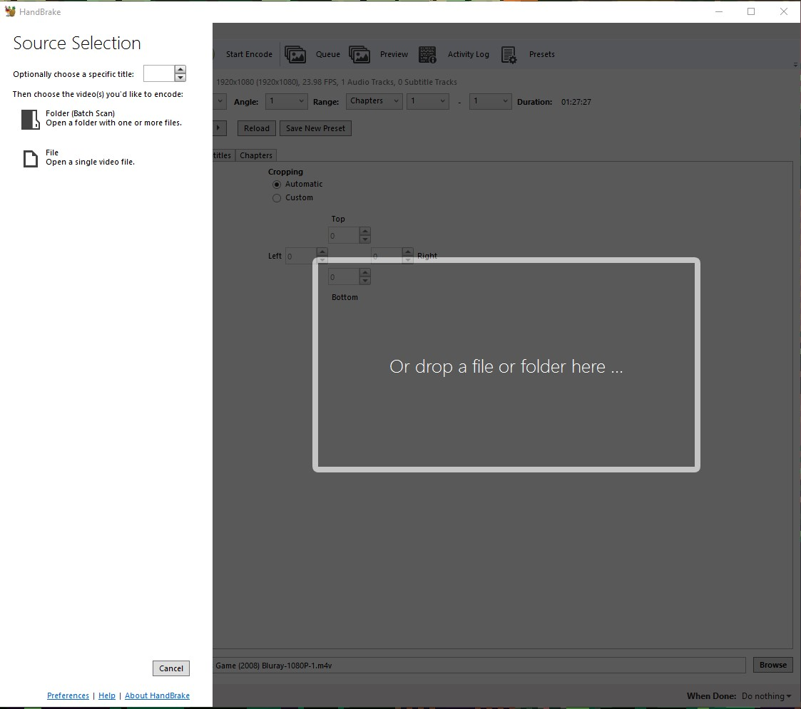
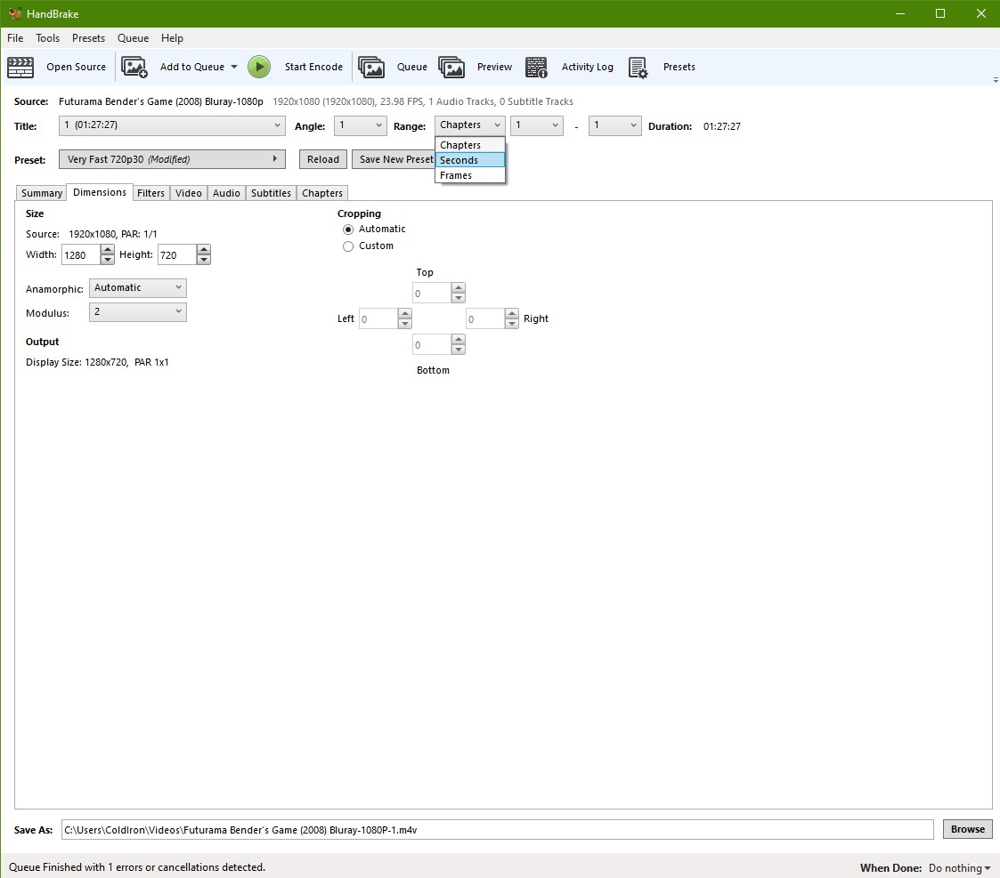
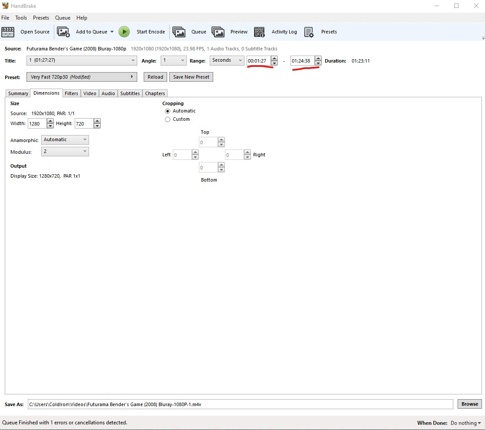
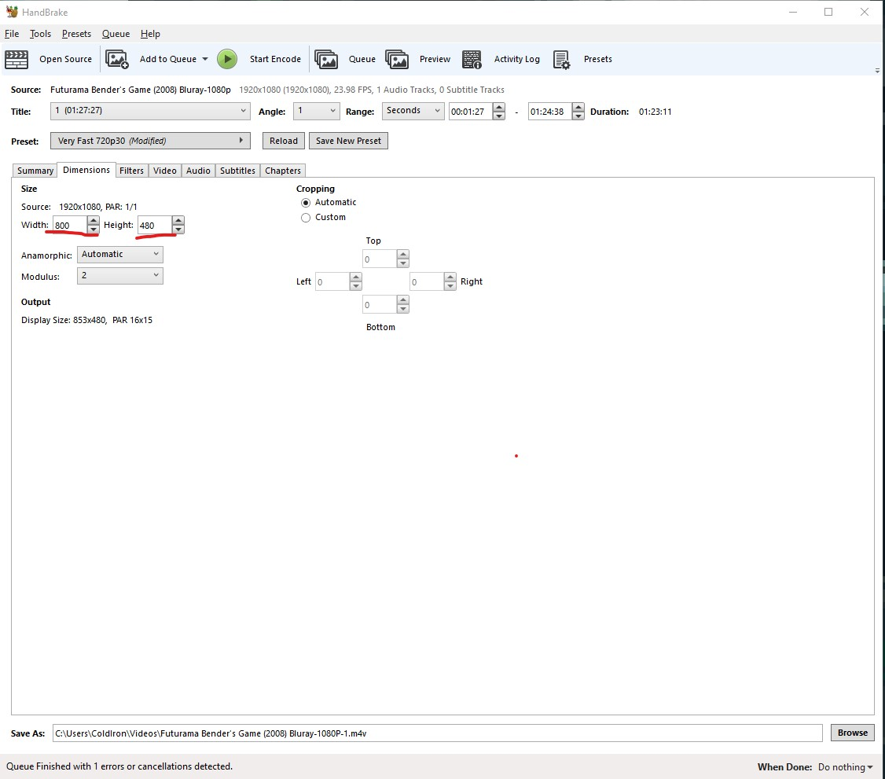
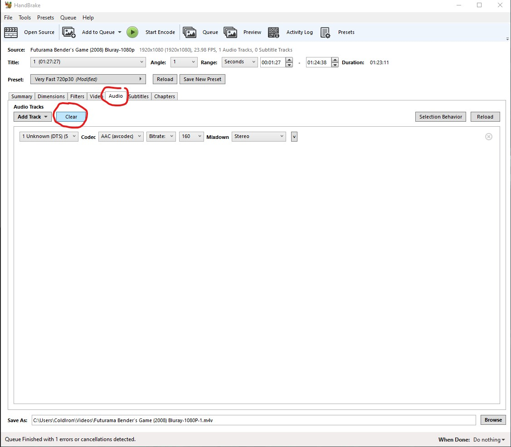
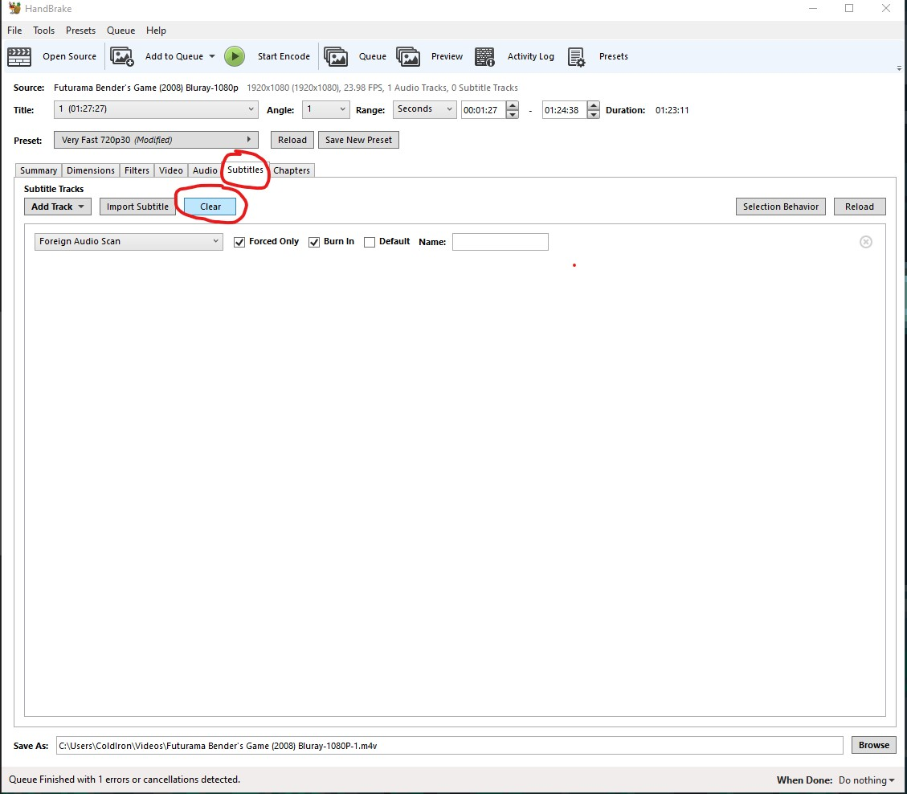
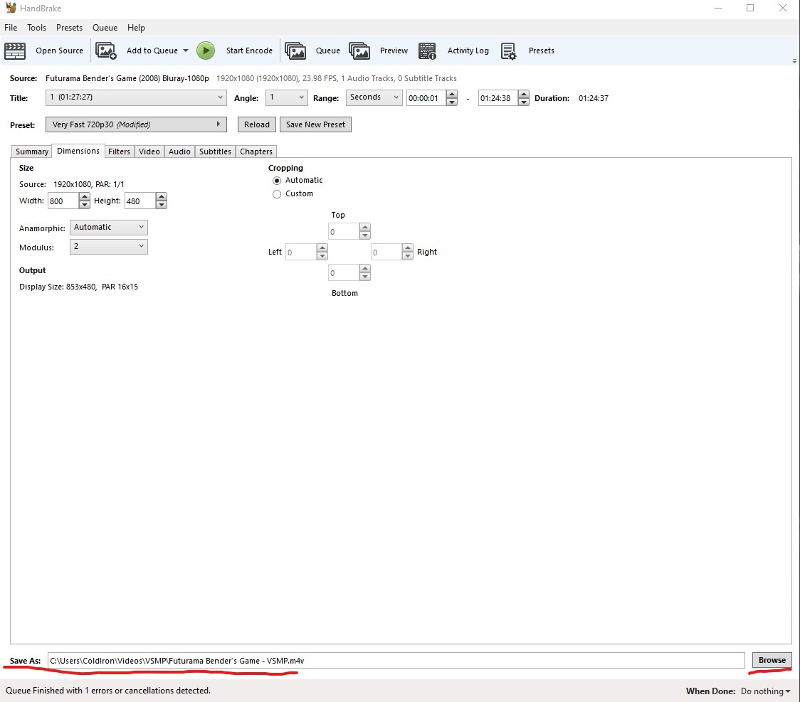

# Handbrake Processing

This document reviews the basic usage of [Handbrake](https://handbrake.fr/) to re-encode video files for the usage of VSMP. Re-encoding your video files for VSMP can have a few advantages:
- remove unusued data
    - audio
    - subtitles
- reduce video quality to match your screen resolution
- reduce file size

This documentation is using v1.3.3 of Handbrake, your milage may vary with different versions.

## Manually processing a file
This guide will also work if you want to extract clips from a movie too. Each of these steps beyond `Open a File` can be done in isolation.

### Open a File
When you open handbrake for the first time it will prompt you to open a video file like picture below. Select the video file you'd like to process by following on screen directions.

### Configure Time Settings
When you're playing a video on your VSMP you likely don't want to include the entire video file. Weather you simply want a clip of the video, or you just want to cut out the start and end credits, its unlikely there isn't some part you could do without. Handbrake gives you the ability to select a time range of what it will encode into a nerew file for you. Select the `Range` drop down and select `Seconds`

Then review your video file and figure out what time range you want to include into you clip. For this example I'm going to cut out the start and end credits. You can see below the sections underlined in `red` where the start and end times go.

### Configure Screen Size
You can adjust the video file's resolution to better match your screens resolution in this section. Changing the dimensions here will by default maintain the video files aspect ratio unless otherwise configured. This means if your 1080P video had black bars when you tested it, the re-encoded file will also have black bars. The difference is the video will contain a lot less pixels in the re-encoded version, so the file size will be much smaller. If you're using a lower resolution eink display, it's unlikely you'll miss any of those extra pixels. 

### Delete Unused Data

#### Remove Audio

Unless you've hooked up sound the your VSMP its unlikely you need any of the audio tracks on the file. To further reduce the file size you can drop the audio tracks by selecting the `Audio` tab and the `Clear` button as seen below.

#### Remove Subtitles

You likely don't need any of the subtitle tracks either. They're removed the same way as the `Audio` tracks but under the `Subtitles` tab.

### Set Your Output
Don't forget to set your output folder and output filename before you let her rip!

### Start Encoding!
Once you have all the settings completed, all thats left is starting the encoding! Depending on your settings, source file, and hardware doing the encoding the amount of time required to complete the encoding process will vary. In my experience using a Ryzen 5900X it typically takes around 10m to encode a full length movie using the setting pictured here.

